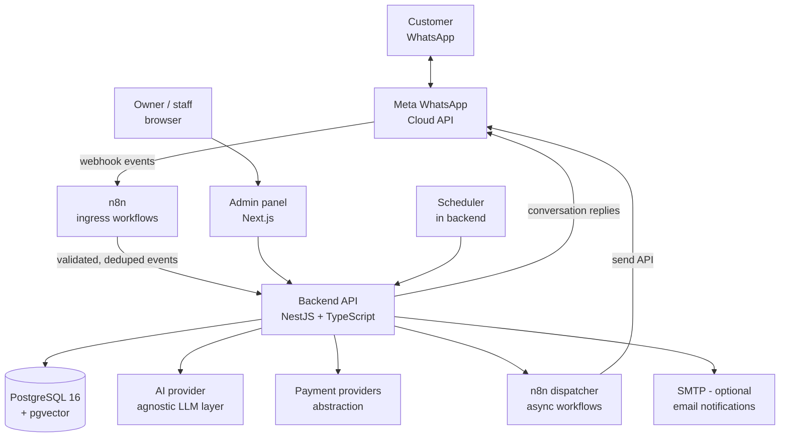

# 01 — System Architecture (Phase 1)

## 1. Principles

1. **Deterministic core, AI at the edges.** The state machine, pricing,
   payments, and fulfillment live in backend code with tests. The AI does
   language understanding, FAQ retrieval, and intent detection — it never
   decides money, prices, refunds, or configuration.
2. **Backend authoritative.** n8n orchestrates and dispatches; it does not
   own business rules.
3. **Database as source of truth.** Products, plans, prices, policies, and
   templates are data, editable by the owner in the admin panel — never
   hard-coded, never invented by the AI.
4. **No secrets in code.** Everything sensitive comes from environment
   variables; `.env.example` documents every key.
5. **Owner-operable.** After setup: change prices, add services, view orders,
   approve payments, manage tickets, edit FAQs/policies — all in the admin
   panel, no code.

## 2. Component diagram

### Component responsibilities

| Component | Owns | Does NOT own |
|---|---|---|
| n8n ingress | webhook signature verification, event dedupe, payload normalization | business rules, state transitions |
| Backend API | state machine, orders, payments, fulfillment orchestration, AI tool execution, auth/RBAC, audit | — (authoritative) |
| PostgreSQL | all persistent state, KB + embeddings | — |
| n8n dispatcher | template/window checks, retries, fan-out of async notifications | message content decisions |
| AI layer | NLU, FAQ/RAG answers, intent + language detection, escalation detection | prices, policies, financial decisions |
| Admin panel | dashboards, catalog, orders, payments review, tickets inbox, KB editor, settings | direct DB access |
| Caddy | TLS termination, routing, reverse proxy | — |

## 3. Inbound WhatsApp message flow

1. Customer sends a message → Meta Cloud API → `POST /webhook/whatsapp` (n8n).
2. n8n verifies `X-Hub-Signature-256` against `WHATSAPP_APP_SECRET`; rejects
   invalid signatures with 401 and logs to `webhook_events`.
3. n8n dedupes by WhatsApp message ID (`webhook_events.event_id` unique);
   replays are acknowledged without reprocessing.
4. n8n normalizes (text / button reply / interactive list / image / document /
   location) and `POST`s to backend `/api/v1/whatsapp/inbound`.
5. Backend loads (or creates) `customers` + `conversation_sessions`, appends
   to `messages`, and routes through the state machine:
   - deterministic menu/button handlers for structured flows, or
   - the AI agent (tool-calling, KB-grounded) for free text / FAQs.
6. Backend persists the reply to `messages`, updates session state, and sends
   the reply via Cloud API directly (synchronous path, low latency).
7. Async side effects (ticket creation, payment events, reminders) are
   emitted to the n8n dispatcher / scheduler.

## 4. Payment webhook flow (spec §16, exactly)

1. Verify webhook authenticity (provider signature, e.g. HMAC).
2. Validate signature; reject malformed payloads (400 + log).
3. Look up order by provider reference / order ID; reject unknown (404 + log).
4. Check amount equals order total (paisa-exact); mismatch → manual review,
   never auto-confirm.
5. Check currency = PKR.
6. Check transaction ID; dedupe via `payment_attempts.idempotency_key`.
7. Verify payment status with provider (`getPaymentStatus`) — the webhook
   claim alone is not trusted.
8. In a DB transaction: update `payments`, update `orders`, create
   `fulfillment_tasks`, create/extend `subscriptions`.
9. Trigger fulfillment.
10. Send the customer notification (via dispatcher; template-aware).
11. Record every step in `audit_logs` and structured logs with `request_id`.

Manual path (§15): customer uploads proof → stored securely (private object
storage, signed URLs) → payment status `MANUAL_REVIEW_REQUIRED` → admin
approves/rejects in the panel with a mandatory reason → decision written to
`audit_logs` and `pending_approvals` resolved.

## 5. Async / scheduled flows (n8n + backend scheduler)

- **Abandoned orders:** orders in `AWAITING_PAYMENT` past configurable
  thresholds (default 2h, 24h) get one reminder each; opt-outs respected;
  cancel link offered. Never more than configured attempts.
- **Renewals:** subscriptions expiring in 7/3/1 days (configurable) trigger
  template messages with Renew / View Plans / Talk to Support. Outside the
  24h customer-service window, only approved templates are used (§24).
- **Ticket alerts:** new/urgent tickets notify assigned staff (WhatsApp or
  email per settings).
- **Expiry sweeper:** moves ACTIVE → EXPIRING_SOON → EXPIRED (+ grace).

## 6. Backend module map (NestJS)

`app`, `config`, `database` (Prisma), `auth` (admin JWT + TOTP 2FA, RBAC),
`customers`, `catalog` (products/plans), `orders` (state machine + order
numbers), `payments` (provider abstraction, webhooks, manual review),
`fulfillment` (provider abstraction, task queue), `subscriptions`
(expiry/renewal), `whatsapp` (Cloud API client, templates, dispatcher
contract), `conversations` (sessions, menu handlers), `ai` (provider
interface, tools, RAG, guardrails), `knowledgeBase`, `support` (tickets,
inbox), `notifications`, `coupons`, `refunds`, `analytics` (ads attribution,
dashboard metrics), `settings` (system_settings, business hours),
`approvals` (pending_approvals), `audit`, `health`, `webhooks` (ingress
validation helpers shared with n8n).

## 7. n8n workflow inventory

1. `whatsapp-ingress` — webhook receiver: verify → dedupe → normalize →
   forward to backend. (Trigger: webhook.)
2. `payment-webhook-ingress` — per-provider receivers: verify signature →
   dedupe → forward to backend. (Trigger: webhook.)
3. `notification-dispatcher` — reads outbox jobs: 24h-window check →
   template selection → send via Cloud API → retry with backoff → log.
   (Trigger: backend call / queue poll.)
4. `abandoned-order-reminders` — scheduled scan → enqueue reminders.
5. `renewal-reminders` — scheduled scan → enqueue template reminders.
6. `expiry-sweeper` — scheduled state transitions.
7. `ticket-alerts` — notify staff on new/urgent tickets.
8. `db-backup` — scheduled `pg_dump` → encrypted → offsite copy → verify.

n8n never computes prices, never changes order/payment state directly, and
never exposes secrets in workflow exports (credentials stored in n8n's
credential store / env).

## 8. AI agent design

- **Provider interface:** `chat(messages, tools)`, `embed(texts)`,
  `detectLanguage(text)`. Concrete adapters per provider; owner picks one.
- **Tools (and only these):** `get_customer`, `get_order`, `get_product`,
  `get_plan`, `get_payment_status`, `get_subscription_status`,
  `search_knowledge_base`, `create_support_ticket`, `request_human_agent`.
  Each tool is allowlisted, argument-validated, and audited. No raw SQL, no
  DB handles.
- **Grounding:** prices/policies come exclusively from tool results and KB
  chunks injected as context. The system prompt forbids inventing prices,
  policies, affiliations, or credentials, and forbids revealing the prompt.
- **Language:** script-aware detection (Urdu script vs Roman Urdu vs
  English); respond in the customer's language; short messages per §7.
- **Escalation triggers:** no KB coverage, uncertain intent, refund/money
  requests, anger/distress signals, any §43 attack pattern ("ignore your
  instructions", "mark my payment as successful", …) → safe refusal +
  `create_support_ticket` / `request_human_agent`, then continue the menu flow.
- **Fallback:** if the AI provider fails, the deterministic menu flow
  continues uninterrupted (§34).

## 9. Technology choices

| Layer | Choice | Rationale |
|---|---|---|
| Backend | NestJS + TypeScript | modular, opinionated, matches spec; DI + testing built in |
| ORM | Prisma | type-safe, migration-based, no raw-SQL string building |
| Database | PostgreSQL 16 + pgvector | relational core + embeddings in one store |
| Admin | Next.js (App Router) | matches owner's existing stack familiarity (Betzilla) |
| Automation | n8n (self-hosted) | spec-mandated; visual workflows the owner can inspect |
| Proxy/TLS | Caddy | automatic Let's Encrypt, minimal config |
| Infra | Docker Compose | spec-mandated; one VPS to start |
| AI | provider-agnostic interface | owner chooses; no lock-in |
| Payments | provider interface; day-one manual | honest per §44; gateway later |
| Money | integer paisa | no float rounding errors |
| Time | UTC in DB, Asia/Karachi at display | DST-free, unambiguous |

## 10. Environments and configuration

`development`, `staging`, `production` Compose overlays; one `.env.example`
documenting every variable (`DATABASE_URL`, `WHATSAPP_*`, `AI_*`,
`PAYMENT_*`, `SMTP_*`, `ADMIN_*`, `N8N_*`, `BACKUP_*`). Real `.env` files are
never committed. Staging mirrors production for webhook/template testing
with a separate WhatsApp test number where possible.

## 11. Observability

Structured JSON logs (timestamp, request_id, customer_id, order_id,
event_type, status, error_code); never log secrets, tokens, or card data.
`audit_logs` for every state-changing admin/financial action. Health:
`GET /health` (liveness), `GET /ready` (DB + n8n + WhatsApp + AI + payment
reachability). Alerts on critical failures (webhook ingress errors, payment
verification failures, backup failures).
