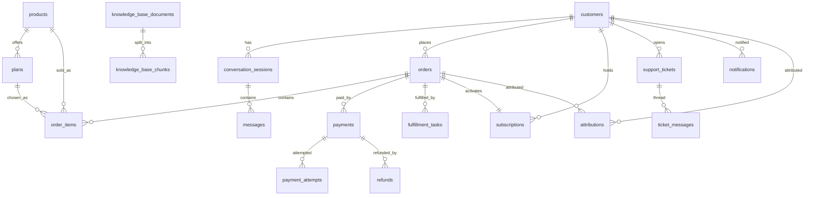

# 02 — Database ERD (Phase 1)

## 1. Conventions

- Primary keys: UUID (`gen_random_uuid()`), one per table.
- Every business table: `created_at`, `updated_at` (UTC, `timestamptz`).
- `audit_logs` and `webhook_events` are append-only (no updates).
- Money: integer paisa (`price_paisa`), never float. Currency fixed `PKR` v1.
- Phone numbers stored in E.164-ish normalized form (`+92…`); unique per customer.
- State/status columns use Postgres enums; **invalid transitions are rejected
  in application code and the transition table is the single source of truth**
  (see `03-workflow-map.md`).
- Embeddings: `vector` (pgvector); dimension configurable per AI provider
  (default 1536).

## 2. Enums

`customer_state` (19 values, §6) · `order_status`
(`DRAFT, AWAITING_PAYMENT, PAYMENT_PROCESSING, PAYMENT_CONFIRMED, FULFILLING,
FULFILLED, ACTIVE, CANCELLED, REFUND_REQUESTED, REFUNDED`)
· `payment_status`
(`PENDING, PROCESSING, PAID, FAILED, EXPIRED, REFUNDED, PARTIALLY_REFUNDED,
MANUAL_REVIEW_REQUIRED`)
· `fulfillment_status` (`PENDING, PROCESSING, COMPLETED, FAILED, MANUAL_REVIEW`)
· `ticket_status` (`OPEN, ASSIGNED, WAITING_CUSTOMER, WAITING_INTERNAL,
RESOLVED, CLOSED`) · `role` (`OWNER, FINANCE, SUPPORT, VIEWER`)
· `approval_status` (`PENDING, APPROVED, REJECTED`) · `kb_status`
(`DRAFT, PUBLISHED, ARCHIVED`) · `message_direction` (`INBOUND, OUTBOUND`)
· `notification_status` (`QUEUED, SENT, DELIVERED, READ, FAILED`)

## 3. Tables (27 = 23 required + 4 supporting)

**Identity & access**
- `customers` — id, whatsapp_number (unique), name, email (nullable),
  language (`en|roman-ur|ur`, default `en`), opted_in (bool, default true),
  state (`customer_state`), notes, timestamps. Attribution is tracked via the
  `attributions` table (customer_id FK there), not a column here — this avoids a
  circular FK between `customers` and `attributions`.
- `users` — id, customer_id (nullable unique FK → customers; reserved for the
  future website portal), email (nullable unique), password_hash (nullable),
  timestamps. Unused by WhatsApp flows in v1.
- `admin_users` — id, email (unique), name, password_hash (argon2),
  role (`role`), totp_secret (encrypted, nullable), totp_enabled (bool),
  is_active, last_login_at, timestamps.

**Catalog**
- `products` — id, slug (unique), name, category, short_description,
  long_description, is_active, sort_order, metadata (jsonb), timestamps.
- `plans` — id, product_id (FK), name, duration_months, duration_days,
  price_paisa (int, ≥ 0), currency (default `PKR`), is_active, sort_order,
  timestamps. Seed: 1mo 83000 / 2mo 150000 / 3mo 210000 / 6mo 360000 /
  12mo 600000 paisa.

**Orders & money**
- `orders` — id, order_number (unique, immutable, `ZSH-YYYYMMDD-#####`),
  customer_id (FK), status (`order_status`), currency, subtotal_paisa,
  discount_paisa, total_paisa, coupon_id (nullable FK), attribution (jsonb),
  source_channel, payment_expires_at, timestamps.
- `order_items` — id, order_id (FK), product_id (FK), plan_id (FK), quantity,
  unit_price_paisa (snapshot at purchase), total_paisa, created_at.
- `payments` — id, order_id (FK), provider (`manual_transfer|…`),
  provider_payment_id (nullable unique), amount_paisa, currency, status
  (`payment_status`), proof_url (nullable, private storage), reviewed_by
  (nullable FK → admin_users), reviewed_at, failure_reason, timestamps.
- `payment_attempts` — id, payment_id (FK), idempotency_key (unique),
  request_payload (jsonb), response_payload (jsonb), status, created_at.
- `refunds` — id, payment_id (FK), amount_paisa, reason, status
  (`approval_status` + provider state), requested_by (FK → admin_users),
  approved_by (nullable FK), provider_refund_id (nullable), timestamps.
- `coupons` — id, code (unique), type (`percent|fixed`), value (int; percent
  1–100 or paisa), max_uses, used_count, valid_from, valid_to, is_active,
  created_by (FK → admin_users), timestamps.

**Subscriptions**
- `subscriptions` — id, customer_id (FK), order_id (unique FK), product_id
  (FK), plan_id (FK), starts_at, expires_at, status
  (`ACTIVE|EXPIRING_SOON|EXPIRED|CANCELLED`), renewal_reminder_stage (int,
  default 0), timestamps.

**Conversations**
- `conversation_sessions` — id, customer_id (FK), channel (default
  `whatsapp`), state (`customer_state`), context (jsonb: selected
  product/plan, draft order, language), return_state (nullable; for
  support-escalation resume), last_inbound_at, timestamps.
- `messages` — id, session_id (FK), direction, whatsapp_message_id (unique,
  nullable), message_type (`text|button|interactive|image|document|…`),
  body_text, template_name (nullable), status (`notification_status`-like),
  error_code (nullable), created_at.

**Support**
- `support_tickets` — id, ticket_number (unique, `ZSH-T-#####`),
  customer_id (FK), order_id (nullable FK), subject, status
  (`ticket_status`), priority (`LOW|MEDIUM|HIGH|URGENT`), assigned_to
  (nullable FK → admin_users), return_state (nullable), resolved_at,
  closed_at, timestamps.
- `ticket_messages` *(supporting)* — id, ticket_id (FK),
  author_type (`customer|agent|ai|system`), author_id (nullable),
  body_text, created_at.

**Knowledge base**
- `knowledge_base_documents` — id, slug (unique), title, language, content
  (text), version (int), status (`kb_status`), updated_by (nullable FK →
  admin_users), timestamps.
- `knowledge_base_chunks` — id, document_id (FK), chunk_index, content,
  embedding (`vector`), created_at.

**Notifications & integrations**
- `notifications` — id, customer_id (FK), channel, template_name (nullable),
  payload (jsonb), status (`notification_status`), whatsapp_message_id
  (nullable), sent_at, error, created_at.
- `message_templates` *(supporting)* — id, name, language, category
  (`utility|marketing|authentication`), body, variables (jsonb),
  meta_status (`draft|submitted|approved|rejected`), is_active, timestamps.
- `webhook_events` — id, source (`whatsapp|payment:<provider>`), event_id
  (unique; provider's id), signature_valid (bool), payload (jsonb),
  processing_status (`RECEIVED|PROCESSED|FAILED|DUPLICATE`), processed_at,
  error, created_at. Append-only.
- `attributions` *(supporting)* — id, customer_id (nullable FK), order_id
  (nullable FK), source (`meta_ad|organic|referral|…`), campaign, adset, ad,
  utm (jsonb), referral (jsonb; Meta click-to-WhatsApp `referral` object),
  created_at.

**Operations & governance**
- `fulfillment_tasks` — id, order_id (FK), task_type, provider
  (`manual|api:<name>`), status (`fulfillment_status`), payload (jsonb),
  result (jsonb, nullable), attempts (int), assigned_to (nullable FK →
  admin_users), completed_at, timestamps.
- `pending_approvals` *(supporting)* — id, action_type
  (`refund|manual_payment|price_change|policy_change|credential_change|customer_delete`),
  entity_type, entity_id, requested_by (FK → admin_users), payload (jsonb),
  status (`approval_status`), decided_by (nullable FK), decided_at,
  reason (mandatory), timestamps.
- `system_settings` — key (PK, text), value (jsonb), description, updated_by
  (nullable FK → admin_users), updated_at.
- `business_hours` — id, day_of_week (0–6, unique), open_time, close_time,
  is_closed, timezone (default `Asia/Karachi`).
- `audit_logs` — id, actor_type (`admin|customer|system|ai`), actor_id
  (nullable), action, entity_type, entity_id (nullable), before (jsonb,
  nullable), after (jsonb, nullable), ip_address (nullable), request_id
  (nullable), created_at. Append-only, no updates.

## 4. Core ERD

## 5. Key constraints & indexes

- Unique: `customers.whatsapp_number`, `orders.order_number`,
  `payments.provider_payment_id`, `payment_attempts.idempotency_key`,
  `webhook_events.event_id`, `messages.whatsapp_message_id`,
  `coupons.code`, `products.slug`, `knowledge_base_documents.slug`.
- Checks: `price_paisa >= 0`, `total_paisa >= 0`, `expires_at > starts_at`,
  coupon percent 1–100.
- FKs with `ON DELETE RESTRICT` for financial records (orders, payments,
  refunds, audit logs are never cascade-deleted); customer deletion is a
  privileged, approval-gated soft anonymization, never a hard delete of
  financial history.
- Indexes: `orders(customer_id, created_at)`, `orders(status)`,
  `payments(status)`, `subscriptions(expires_at, status)`,
  `messages(session_id, created_at)`, `webhook_events(source, created_at)`,
  `audit_logs(entity_type, entity_id, created_at)`,
  `knowledge_base_chunks` ivfflat/hnsw on `embedding` (provider dimension).
- Order numbers: `ZSH-YYYYMMDD-#####` via a per-day sequence
  (`order_seq_YYYYMMDD`) created atomically; never reused, never updated.

## 6. Migrations & seeds (Phase 2)

- Prisma schema as the single source of truth; `prisma migrate` for
  versioned migrations; down-migrations reviewed, never auto-run in prod.
- Seeds: the 5 learning-service plans with exact spec prices; product
  "Learning Access" (active) + placeholder categories (inactive until the
  owner defines them); KB DRAFT skeletons (About, Products, Plans & Prices,
  How It Works, Payment Methods, Refund/Delivery/Support policies, Terms,
  Privacy, FAQs); default `system_settings` (reminder offsets, grace period,
  payment window); business hours placeholder (owner sets); first Owner
  admin created via CLI (never seeded with a default password).
