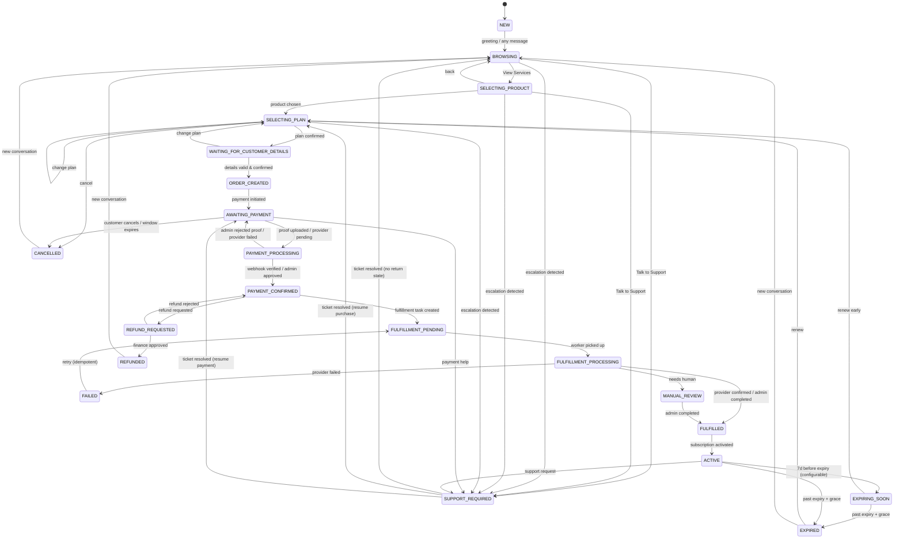
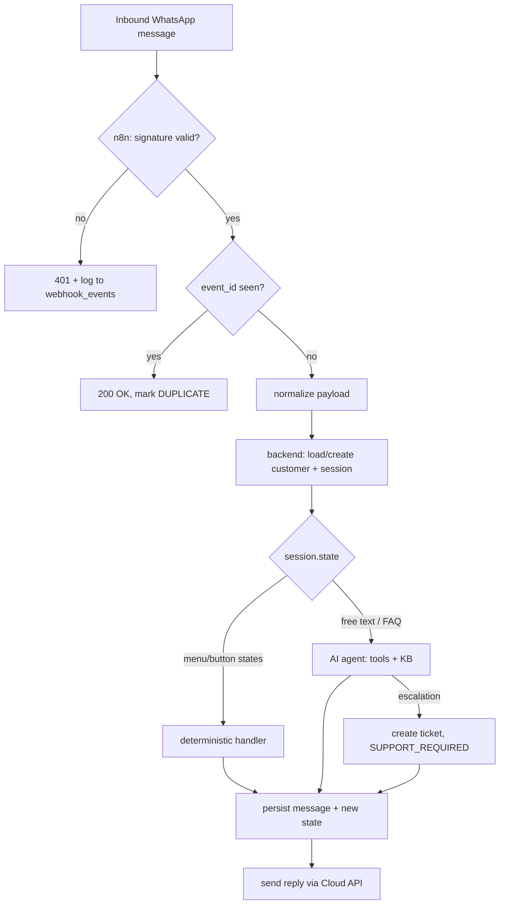

# 03 — Workflow Map (Phase 1)

## 1. Customer state machine

All 19 states from spec §6. Transitions are enforced by a single transition
table in backend code; any transition not listed here is rejected and logged.



**Guards (examples):**
- `SELECTING_PLAN → WAITING_FOR_CUSTOMER_DETAILS` requires an active plan;
  the price shown is read from `plans.price_paisa` at render time — never
  from AI output, never from the client.
- `PAYMENT_PROCESSING → PAYMENT_CONFIRMED` requires either a verified
  provider webhook (amount + currency + status checks, §16) or an admin
  approval row in `pending_approvals`. Customer claims, screenshots, and
  button clicks alone can never fire this transition.
- `FULFILLMENT_PROCESSING → FULFILLED` requires provider confirmation or an
  admin completion action. The customer is never told "delivered" before this.
- `SUPPORT_REQUIRED` stores `return_state`; on ticket resolution the session
  resumes exactly where it left off.
- `AWAITING_PAYMENT → CANCELLED` fires on explicit cancel or after the
  payment window (configurable, default 72h) with no payment activity.

## 2. Inbound message handling



Greeting keywords (`hi`, `hello`, `salam`, `assalamualaikum`, `price`,
`info`, `start` — case-insensitive, Urdu variants included) always render
the main menu from §7. Messages stay short; lists use WhatsApp interactive
messages (buttons/list) where supported, plain numbered text otherwise.

## 3. Order → payment → fulfillment sequence

```mermaid
sequenceDiagram
    participant C as Customer
    participant W as WhatsApp Cloud API
    participant B as Backend
    participant DB as PostgreSQL
    participant P as Payment provider / admin
    participant F as Fulfillment
    C->>W: selects plan, confirms summary
    W->>B: inbound event (via n8n)
    B->>DB: create order (DRAFT→AWAITING_PAYMENT) in transaction
    B->>W: payment instructions / provider link
    C->>P: pays (transfer + proof upload, or provider checkout)
    P->>B: webhook / admin approval
    B->>B: verify signature, amount, currency, status; dedupe
    B->>DB: tx: payment PAID → order PAYMENT_CONFIRMED → create fulfillment task + subscription
    B->>F: execute fulfillment (API) or create admin task (manual)
    F->>B: confirmation
    B->>DB: order FULFILLED → subscription ACTIVE
    B->>W: delivery confirmation + expiry date (template-aware)
```

`ORDER` / `MY ORDER` → prompt for order ID → look up by `order_number` →
show status card (Order / Status / Service / Plan / Expires / Support) per §17.

## 4. Manual payment review (day-one path)

1. Customer uploads screenshot/document → stored in private storage, signed
   URL only → payment status `MANUAL_REVIEW_REQUIRED`, customer told:
   "Thanks — our team will verify this. Your order is safe."
2. Admin sees the review queue with order, amount, proof, customer history.
3. Approve → `pending_approvals` row (reason mandatory) → payment PAID →
   order continues. Reject → reason mandatory → customer notified with
   "request new proof" option; state returns to `AWAITING_PAYMENT`.
4. Every decision lands in `audit_logs` with admin identity and timestamp.

## 5. Support ticket lifecycle

`Talk to Support` (menu or AI escalation) → "Sure, I'll connect you with our
support team." → ticket `OPEN` (stores customer, order if any, issue summary,
`return_state`) → staff notified → `ASSIGNED` → conversation in the admin
inbox (agent replies go out via WhatsApp) → `WAITING_CUSTOMER` /
`WAITING_INTERNAL` as needed → `RESOLVED` → customer confirms or auto-closes
after configurable N days → `CLOSED` → session resumes `return_state`.
Outside business hours: ticket still created; auto-reply gives expected
response time from `business_hours`.

## 6. Reminder schedules (all configurable in `system_settings`)

- **Abandoned orders:** `AWAITING_PAYMENT` for 2h → reminder 1 ("Your order
  is still waiting for payment. Would you like to continue?" + Continue /
  Change Plan / Cancel); 24h → reminder 2 (final); then no more. Opt-out
  (`STOP` / "unsubscribe") sets `opted_in=false` and silences marketing-type
  nudges permanently.
- **Renewals:** 7d / 3d / 1d before expiry → approved template messages with
  Renew Now / View Plans / Talk to Support. Outside the 24h window, templates
  only (§24/§25).
- **Expiry sweeper:** ACTIVE → EXPIRING_SOON at 7d; → EXPIRED after
  expiry + grace (default 3d).

## 7. High-risk admin approval flow (§42/§51)

Refund / manual payment approval / price change / payment-config change /
credential change / customer-data deletion / policy change →
creates `pending_approvals` (requester, payload, mandatory reason) →
requires Owner or Finance decision → on approve, the action executes and both
request + decision are written to `audit_logs` → customer notified where
relevant. Support and Viewer roles cannot request or decide financial actions.
