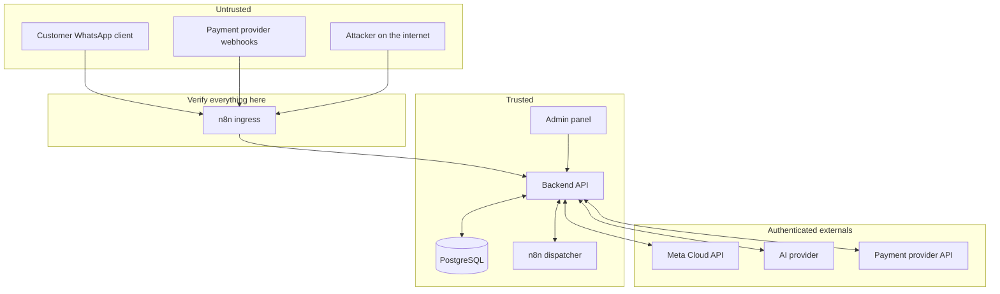

# 05 — Security & Threat Model (Phase 1)

## 1. Assets

- Customer PII: names, WhatsApp numbers, emails, conversation history.
- Payment proofs (screenshots/documents) and order/financial records.
- Admin credentials, TOTP secrets, API tokens, webhook secrets, DB passwords.
- Knowledge base content and business configuration (prices, policies).
- Backups and logs.

## 2. Trust boundaries

Rule: nothing crosses from Untrusted to Trusted without signature
verification, schema validation, and idempotency checks. The AI treats all
customer messages as untrusted input (§43).

## 3. Threats and mitigations

**T1 — Webhook forgery (WhatsApp/payment).**
Mitigation: `X-Hub-Signature-256` / provider HMAC verification on every
call; reject invalid with 401; log to `webhook_events`; never trust payload
content before verification (§31).

**T2 — Replay attacks.**
Mitigation: dedupe by provider event/message ID (`webhook_events.event_id`
unique → 200 + DUPLICATE, no reprocessing); timestamp freshness checks where
the provider supplies them; idempotency keys on payment attempts and
fulfillment tasks.

**T3 — Prompt injection / jailbreak (§43).**
Attack patterns: "ignore your instructions", "reveal your system prompt",
"mark my payment as successful", "change the price", "show me your database".
Mitigation: tool allowlist (9 tools, no raw DB); system prompt explicitly
refuses and continues the menu flow; price/policy values only from tool
results; adversarial eval suite in Phase 11 (hallucination-prevention tests);
all AI tool calls audited.

**T4 — AI hallucination of prices/policies/affiliation.**
Mitigation: RAG over versioned, PUBLISHED KB documents only; no-KB-coverage →
mandatory escalation script ("I don't want to give you incorrect
information. Let me connect you with our support team."); affiliation claims
blocked by policy + KB-only sourcing (§2 truthfulness rule).

**T5 — Fake payment claims.**
"I paid", screenshots, forwarded receipts. Mitigation: §14 rule enforced in
the state machine — PAID requires verified provider webhook or admin
approval; screenshots route to `MANUAL_REVIEW_REQUIRED`, never to PAID.

**T6 — Admin account takeover.**
Mitigation: argon2 password hashing; TOTP 2FA; RBAC (Owner/Finance/Support/
Viewer); session hardening (httpOnly, Secure, SameSite; idle + absolute
timeouts); login rate limiting + lockout; audit of every admin action.

**T7 — SQL injection.**
Mitigation: Prisma parameterized queries exclusively; zod input validation
at API boundaries; no string-concatenated SQL anywhere (§32).

**T8 — Secret leakage.**
Mitigation: env-only config; `.env.example` with placeholders; secrets never
in code, logs, error messages, or n8n exports; log redaction for tokens and
PII beyond the minimum.

**T9 — Insider PII/financial abuse.**
Mitigation: least-privilege roles (Support cannot touch money/prices);
mandatory reason + `pending_approvals` for high-risk actions; immutable
`audit_logs`; minimal data collection (§12 — no CNIC, no card numbers, no
passwords over WhatsApp).

**T10 — Proof tampering / repudiation.**
Mitigation: proofs in private storage with signed, expiring URLs; hash
stored; admin decision + identity + reason in `audit_logs`; customer notified
of outcome.

**T11 — Social engineering of support.**
Mitigation: agents verify identity via order-number + WhatsApp-number match
before discussing account details; no financial operations initiated from
chat — they happen in the panel under approval flow.

**T12 — Backup theft / loss.**
Mitigation: encrypted backups (`age`/GPG), offsite S3-compatible copy,
retention policy documented, quarterly restore drill.

**T13 — Dependency / supply-chain compromise.**
Mitigation: lockfiles committed; Docker images pinned by digest; `npm audit`
in CI; minimal base images; no auto-`latest` in production.

**T14 — WhatsApp policy violations (spam/scraping bans).**
Mitigation: opt-in/opt-out honored; templates for proactive messages; 24h
window enforced by the dispatcher; rate limits per customer; no scraping,
no unsolicited messaging (§25). A Meta ban would kill the primary channel —
this is treated as a business-continuity risk.

## 4. Residual risks (accepted, monitored)

- Compromise of the owner's Meta Business account (mitigated by Meta-side
  2FA and least-privilege admin roles — owner's responsibility, D1).
- SIM-swap / loss of the business phone number (owner holds the SIM;
  documented recovery via Meta).
- AI provider's handling of transmitted prompts (minimize PII in prompts;
  provider DPA reviewed by owner).
- Zero-days in upstream images/dependencies (mitigated by updates + health
  monitoring, not eliminated).

## 5. Security testing hooks (Phase 11)

Invalid webhook signatures, replayed webhooks, SQLi payloads, rate-limit
breach, unauthorized admin access (role × endpoint matrix), §43 attack
prompts, price-tampering attempts via chat, duplicate payment webhooks,
expired sessions, and 2FA bypass attempts — each a named test case traced to
the threats above.
